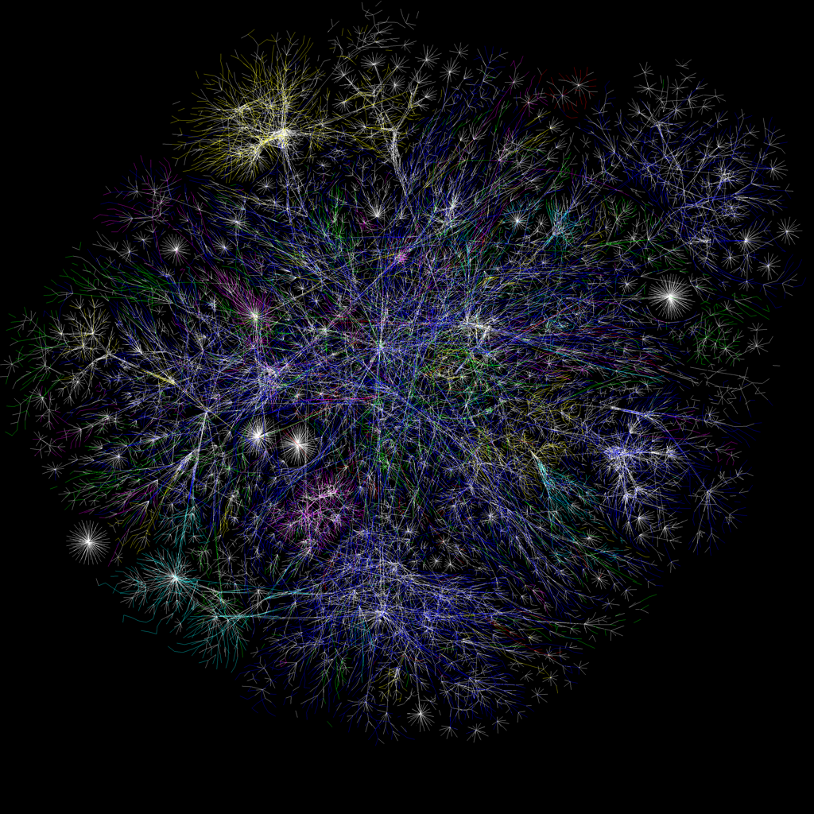

```{r setup, include=FALSE}
knitr::opts_chunk$set(echo = FALSE)

library(tidyverse)
library(kableExtra)
library(googlesheets4)
library(DT)

# Learn more about creating websites with Distill at:
# https://rstudio.github.io/distill/website.html

# Learn more about publishing to GitHub Pages at:
# https://rstudio.github.io/distill/publish_website.html#github-pages

```

```{r, out.width = "100%", fig.cap="Visualization of the internet"}


```

## Instructor

[Julien Brun](https://brunj7.github.io/about.html) (brun\@nceas.ucsb.edu)

## Important links

-   [Course syllabus](https://bren.ucsb.edu/courses/eds-213)
-   [Code of Conduct](code_of_conduct.html)

## Course description

This course will cover the concept of metadata and how it can be leveraged for the integration of heterogeneous datasets into standardized data products. We will practice how to download data from data repositories both manually and programmatically relying on APIs. We will also discuss how to track the provenance of data, generate metadata integrating data semantics to increase data discovery, as well as archiving data products on data repositories to make them available to the broader community.


## Learning objectives

- Re-use data from others leveraging data repositories and metadata standards

- Rely on APIs to programmatically access and download data 

- Understand concept of metadata, data semantics and data preservation and why it matters in our path towards reproducible and open science.v


## Curriculum 

EDS 213 is a half Fall quarter course (2 units) running from Monday 2021-09-27 to Wednesday 2021-10-27. The course is developed around two main themes:

- Re-using data from others
- Preserving your data

## Office hours

Mondays from 1-2PM, except Monday 10/11 2-3PM (due to workshop)

## Session (subject to change)

```{r echo=FALSE, message=FALSE}
# gs4_deauth()
# 
# #read the scheduel from Google Sheet
# sched <- read_sheet("https://docs.google.com/spreadsheets/d/1GckWJ4li6G2AyCjS8MrQSN6znym27aO9IPujdWfHc14/edit#gid=492363688")
# 
# datatable(sched, rownames=FALSE)
```
| Day / Session |	Session Type |	Topics |
|-----------|-------|--------------------------------|
| Monday 9/27	| week 1 - Lecture |	[Re-using data -- Data Preservation & Data Repositories](week_1.html) |
| Wednesday 9/29	| week 1 - Lab	| Re-using data -- Using dataONE to find environmental data & Journal club|
| Monday 10/4	| week 2 - Lecture	| [Re-using data -- Accessing data in a programatically way](week_2.html#monday-10042021-lecture) |
| Wednesday 10/6	| week 2 - Lab	| [Re-using data -- APIs for environmental data](week_2.html#wednesday-10062021-using-apis-lab) |
| Monday 10/11	| week 3 - Lecture	| [Preserving data -- Data modeling & Metadata standards for environmental data](week_3.html#monday-10112021-lecture) |
| Wednesday 10/13	| week 3 - Lab	| [Preserving data -- Developing your Data Management Plan](week_3.html#wednesday-10132021-lab) | 
| Monday 10/18	| week 4 - Lecture	| [Preserving data -- Data Provenance and Semantics](week_4.html#monday-10182021-lecture) | 
| Wednesday 10/20	| week 4 - Lab	| [Preserving data -- Preserving Data on the KNB](https://brunj7.github.io/EDS-213-metadata/week_4.html#wednesday-10202021-lab)  |
| Monday 10/25	| week 5 - Lecture	| [Meet your next instructor](week_5.html) -- Group Project Q&A |
| Wednesday 10/27	| week 5 - Lab	| [Group Project presentations](group_project.html#group-projects) |


## Grading

The grading for this course is organized as follow:

- 20% Class participation
- 30% Lab / Assignments
- 50% Group project

## Course requirements

### Computing

- Minimum [MEDS device requirements](https://ucsb-meds.github.io/computer_reqs.html)

- Have a ready to be used GitHub Account (https://github.com/) 


### Textbook (optional)

- R for Data Science: https://r4ds.had.co.nz/
- Recknagel, F., Michener, W.K., 2018. Ecological Informatics: Data Management and Knowledge Discovery. Springer International Publishing, Cham, pp. 3–10. https://doi.org/10.1007/978-3-319-59928-1_1 (selected chapters)
- Nielsen Michael, Reinventing Discovery, 2013. https://press.princeton.edu/books/paperback/9780691160191/reinventing-discovery (accessible through the library)


