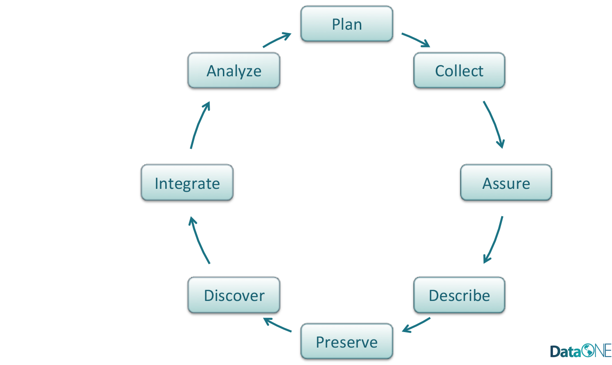
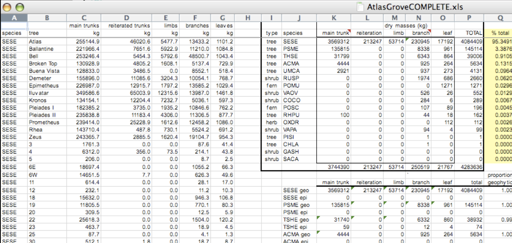
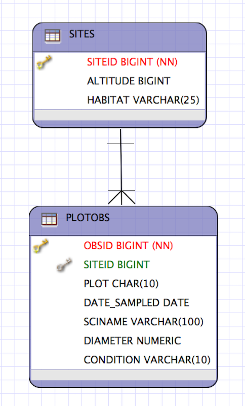

```{r setup, include=FALSE}
knitr::opts_chunk$set(echo = FALSE)
```

# Managing your Data

**Data is a valuable asset!!**

Data should be managed to:

- Maximize the effective use and value of data
- Continually improve the quality (accuracy, integrity, integration,...) 
- Ensure appropriate use of data and information
- Facilitate data sharing 
- Ensure sustainability and accessibility in long term for re-use in science

---

## Data Life Cycle

The data life cycle provides a high level overview of the stages involved in successful management and preservation of data for use and reuse.

```{r, out.width="70%", fig.align='center'}

```
---

# Data Management Plans (DMP)


### A data management plan **describes how you will manage your data during the lifetime of a research project**. The process of creating your DMP will force you to think about potential issues related to the project's data that could affect timeline, costs and personnel needed.

---

# Data Management Plans (DMP)

## Goal: Answer these 4 questions:

1. How much data will be collected and how will it be treated?

2. How much time is needed to manage the data and who will be responsible for doing so?

3. How long should the data be preserved and where is the best location to do so?

4. Are there any legal constraints associated with acquiring, using and sharing project data?


.footnote[
*from  Recknagel and Michener. "Ecological Informatics", 2017*
]

---

# Don't loose your data

## *Accidents happen !!!*

 

---

# Document: Sooner the Better

Document and preserve your data when you are actively analyzing them! 

```{r fig.cap = "Recknagel and Michener, 2017", out.width="50%", fig.align='center'}

```

<div class="notes">
At this time, it is the easiest for you to document and preserve your project’s data, because you know and understand the most about them. Then slowly, or more rapidly due to life events and technology shifts, what you know about the data declines.
</div>

---

# Document Soon, it is also for yourself

You would not have to remember:

- The name of that file?

- The directory where you put it?

- The units those measurements were taken in?

- Which sample site was which?

- Is it the cleaned version of the data set used for publication?

<br>

**=>  Easier to share with others, good for collaborations!**

---
class: center, middle, inverse

# Data Modeling for Data Reuse


---

# Benefits of normalized or "tidy" data 

### Analitycal:

- Powerful search and filtering

- Handle large and/or complex data sets

- Help to enforce data integrity

- Easier to handle data updates

<br>

###*=> Easier to conduct your analysis and even so for others!!*

---

# Benefits of normalized or "tidy" data 


## Preservation:

- Easier to describe

- Easier to automate metadata creation

- Easier to implement Quality Check

---

# Data Heterogeneity

Data are heterogeneous in:

- **Structure** (schema): Logical model of the data (e.g., tables, hierarchical trees, raster images, etc.)

- **Semantics**: Specific meaning of the data (e.g., nature and types of measurements, importance of contextual information, interpretation of record structure, etc.): documentation

- **Syntax**: Digital format of the data (e.g., csv, “R data frame”, NetCDF, Excel XLSX, DBF, etc.)

---

# Why Tabular Data?

Spreadsheets are (still) the primary data entry tool of the digital age!

```{r, out.width="70%", fig.align='center'}
knitr::include_graphics("images/spreadsheet-1.png")
```

### *_=>  Encourages you to mix your data and your analysis_*

---

# Data Organization

```{r out.width = "100%"}

```

---

# Multiple tables

```{r out.width = "100%"}
knitr::include_graphics("images/excel-org-02.png")
```

---

# Inconsistent observations

```{r out.width = "100%"}
knitr::include_graphics("images/excel-org-03.png")
```

---

# Inconsistent variables

```{r out.width = "100%"}
knitr::include_graphics("images/excel-org-04.png")
```

---

## Marginal sums and statistics == Analysis

```{r out.width = "100%"}
knitr::include_graphics("images/excel-org-05.png")
```

*=>  A Spreadsheet is not a table !!*

---
class: center, middle, inverse
# Good enough data modeling

---

# Terminological Soup


Table = Relation = Data set   (~ Worksheet) 

Column = Variable = Attribute = Characteristic

Row = Record = Tuple  <> Observation

Keys are used to Join or Merge

Cell = Value = Measurement 

Data Model = Schema

---

# Denormalized data (aka non-tidy data)

Observations about different entities combined

```{r out.width = "90%"}
knitr::include_graphics("images/table-denorm.png")
```

<div class="notes">
In the above example, each row has measurements about both the `site` at which observations occurred, as well as observations of two individuals of possibly different species found at that site.  This is *not normalized* data.

People often refer to this as *wide* format, because the observations are spread across a wide number of columns.  Note that, should one encounter a new species in the survey, we wold have to add new columns to the table.  This is difficult to analyze, understand, and maintain.
</div>

---

# Tabular data

__Observations__. A better way to model data is to organize the observations about each type of entity in its own table.  This results in:

- Separate tables for each type of entity measured

- Each row represents a single observed entity

- Observations (rows) are all unique

__This is *normalized* data (aka *tidy data*)__

---

# Tabular data

__Variables__. In addition, for normalized data, we expect the variables to be organized such that:

- All values in a column are of the same type

- All columns pertain to the same observed entity (e.g., row)

---

# Tabular data

```{r , out.width="80%"}
knitr::include_graphics("images/tables-norm.png")
```

<div class="notes">
Here's an example of tidy (normalized) data in which the top table is the collection
of observations about individuals of several species, and the bottom table are the
observations containing properties of the sites at which the species occurred.
</div>

---

# How to relate tables?

When one has normalized data, we often use unique identifiers to reference
particular observations, which allows us to link across tables.  Two types of
identifiers are common within relational data:

- _Primary Key_: unique identifier for each observed entity, one per row
- _Foreign Key_: reference to a primary key in another table (linkage)

---

# How to relate tables?

```{r}

```

<div class="notes">
For example, in the second table below, the `site` column is the *primary key* 
of that table, because it uniquely identifies each row of the table as a unique
observation of a site.  In the first table, however, the `site` column is a 
*foreign key* that references the primary key from the second table.  This linkage
tells us that the first height measurement for the `DAPU` observation occurred
at the site with the name `Taku`.
</div>

---

# Entity-Relationship Model (ER)

An Entity-Relationship model allows us to compactly draw the structure of the
tables in a relational database, including the primary and foreign keys in the tables.

.pull-left[
```{r, out.width="70%"}

```
]

.pull-right[
<br>
<br>
In the above model, one can see that each site in the `SITES` table must have one
or more observations in the `PLOTOBS` table, whereas each `PLOTOBS` has one and 
only one `SITE`.
]

---

# Simple Guidelines for Effective Data Preservation

- Design to add rows, not columns

- Each column one type

- Header line

- Non-proprietary formats

- Descriptive names

- No spaces

---

# Semantic Ambiguity

- Column headers: 
   - Avoid cryptic names
   - Concise, but not meaningful 
   - Units (kg or g?) 
   
- Color coding:
   - avoid using formatting (implicit)
   - add a column to store this information with a flag

---

# Semantic Ambiguity

```{r}

```

---

# Semantic Ambiguity

```{r}

```

---

# Semantic Ambiguity

```{r}

```

---

# Semantic Ambiguity

```{r}
knitr::include_graphics("images/semantics-right.png")
```


---

# Resources used

- Recknagel, F., Michener, W.K., 2018. Ecological informatics: data management and knowledge discovery, 3rd ed. ed. Springer, Cham.
- DataONE, Data Life Cycle: https://www.dataone.org/data-life-cycle
- DataONE data management guide: https://www.dataone.org/sites/all/documents/DataONE-PPSR-DataManagementGuide.pdf
- ESIP, Data Management Plans: http://commons.esipfed.org/datamanagementshortcourse
- Borer, Elizabeth T., Eric W. Seabloom, Matthew B. Jones, and Mark Schildhauer. (2009) "Some Simple Guidelines for Effective Data Management." The Bulletin of the Ecological Society of America 90, no. 2: 205-14. https://doi.org/10.1890/0012-9623-90.2.205
- Michener, W. K. (2015). Ten Simple Rules for Creating a Good Data Management Plan. PLoS Comput Biol , 11(10). presented at the 10/2015.  https://doi.org/10.1371/journal.pcbi.1004525
- [Borer et al. 2009. **Some Simple Guidelines for Effective Data Management.** Bulletin of the Ecological Society of America.](http://matt.magisa.org/pubs/borer-esa-2009.pdf)
- [Software Carpentry SQL tutorial](https://swcarpentry.github.io/sql-novice-survey/)
- [Tidy Data](http://vita.had.co.nz/papers/tidy-data.pdf)


---


# Aknowledgements

These slides have been adapted from NCEAS training to rescue coral reef data in collaboration with CRESCYNTH.
