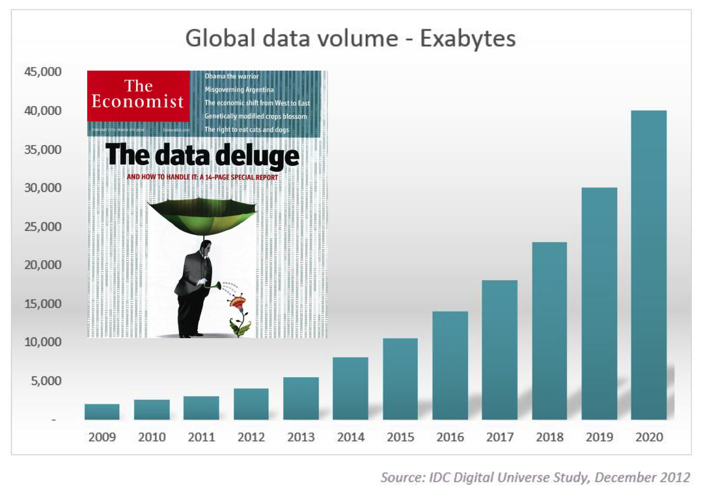
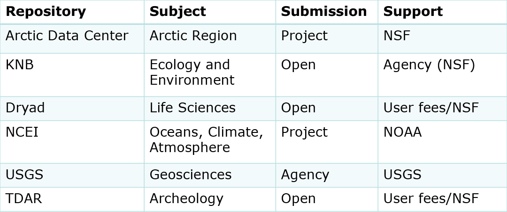
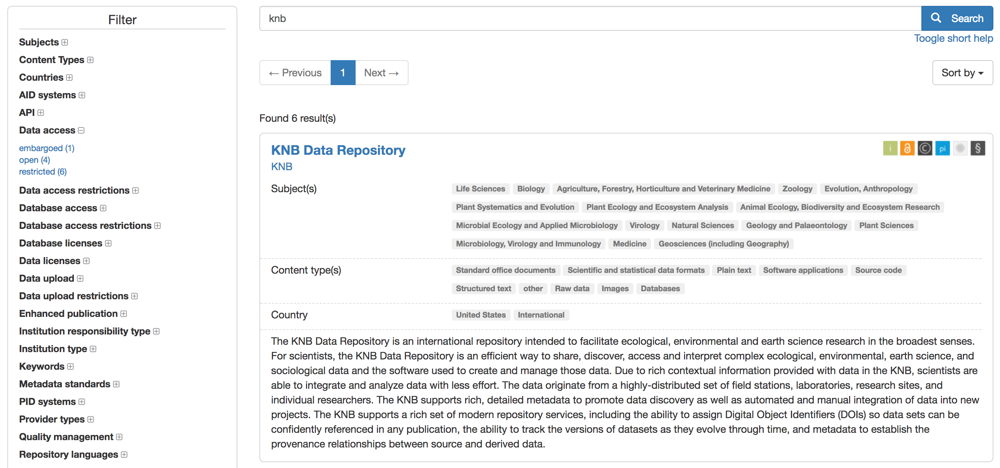

```{r setup, include=FALSE}
options(htmltools.dir.version = FALSE)
```


class: center, middle, inverse

# Motivation


---

# The Need for Data Management -- Big Data


---

# Data Deluge



---

# Why Manage Data? Advancement of Science

- Data is a valuable asset – it is expensive and time consuming to collect 

- Data should be managed to:
  - maximize the effective use and value of data and information assets
  
  - continually improve the quality including: data accuracy, integrity, integration, timeliness of data capture
  
  - ensure appropriate use of data and information
  
  - ensure sustainability and accessibility in long term for re-use in science

---
  
# The Need for Data Management -- Public Perception

```{r, echo=FALSE, out.width="50%", fig.align = "center"}
knitr::include_graphics("images/ClimateGate.png")
```


???

*"The climate scientists at the center of a media storm over leaked emails were yesterday cleared of accusations that they fudged their results and silenced critics, but a review found they had failed to be open enough about their work."*

---

# Why Manage Data? Researcher Perspective

- Keep yourself organized – be able to find your files

- Track your science processes for reproducibility

- Quality control your data more efficiently

- To avoid data loss (e.g. making backups)

- Gain credibility and recognition for your science efforts through data sharing!

---

# The Need for Data Management: Data Entropy


*Michener et al 1997; Vines et al 2014*

---

# The Data Life Cycle


---

# Data Reuse


---

# Barriers to Data Reuse


- Data not preserved

  - Tiny proportion of ecological data are readily available
  
- Dispersed, isolated repositories

  - Each community has its own; disconnected; underutilized
  
- Lack of software interoperability

  - Metacat, DSpace, Mercury, iRODS, XMCat, OPeNDAP, ...
  
- Heterogeneous data

  - Many data formats, metadata formats, and varying semantics

---

# Solutions


- **Preserve data**

- Adopt standards (e.g. metadata, APIs, ...)

- Create networks

- Use interoperable formats and date models

---

# Preserving Data

- Datasets are preserved with long-term commitment

- Datasets are versioned and citeable

- Datasets are searchable and discoverable

---
class: center, middle, inverse

# FAIR

---

# FAIR Data Guiding Principles

**Concise and measurable set of principles to enhance the reusability of data**

- Data should be Findable

- Data should be Accessible

- Data should be Interoperable

- Data should be Re-usable

---

# To be FINDABLE

F1. (meta)data are assigned a globally unique and eternally persistent identifier

F2. data are described with rich metadata

F3. (meta)data are registered or indexed in a searchable resource

F4. metadata specify the data identifier

---

# To Be ACCESSIBLE

A1  (meta)data are retrievable by their identifier using a standardized communications protocol

A1.1 the protocol is open, free, and universally implementable

A1.2 the protocol allows for an authentication and authorization procedure, where necessary

A2 metadata are accessible, even when the data are no longer available


---

# To Be INTEROPERABLE

I1. (meta)data use a formal, accessible, shared, and broadly applicable language for knowledge representation

I2. (meta)data use vocabularies that follow FAIR principles

I3. (meta)data include qualified references to other (meta)data

---

# To Be RE-USABLE

R1. meta(data) have a plurality of accurate and relevant attributes

R1.1. (meta)data are released with a clear and accessible data usage license

R1.2. (meta)data are associated with their provenance

R1.3. (meta)data meet domain-relevant community standards


---
class: center, middle, inverse

# Data Repositories


---


# What is a data repository?

 
<br>
<br>


| System            | Long-Term | Versioned | Citable | Discoverable |
|:------------------|:----------|:----------|:--------|:-------------|
|Google Drive       |maybe      |maybe      |no       |no            |
|GitHub             |yes        |yes        |no       |no            |
|University Server  |maybe      |no         |no       |maybe         |
|KNB                |yes        |yes        |yes      |yes           |

---

# Data Repositories


 
 

---

# DataONE

Federation of data repositories   **https://www.dataone.org/**

 
---

# Google Dataset Search

**https://datasetsearch.research.google.com/**

 
---

# Finding the Right Repository

Search engine for data repositories  https://www.re3data.org/

 
 


---

# Aknowledgement

This presentation has been adapted from the CRESCYNT training course organized by NCEAS and CRESCYNT. Credits goes to Matt Jones, Amber Budden, Jeanette Clark and many more.


