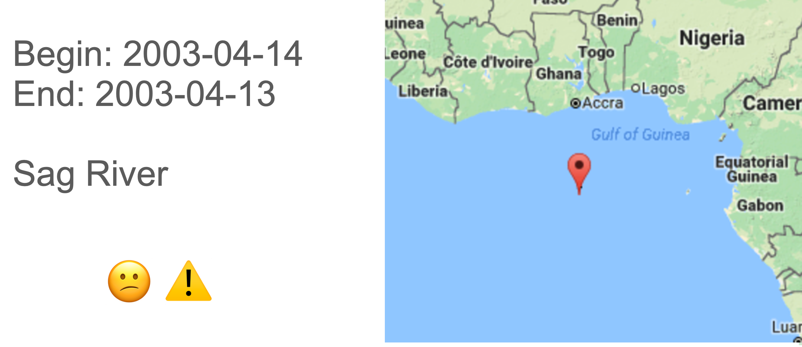
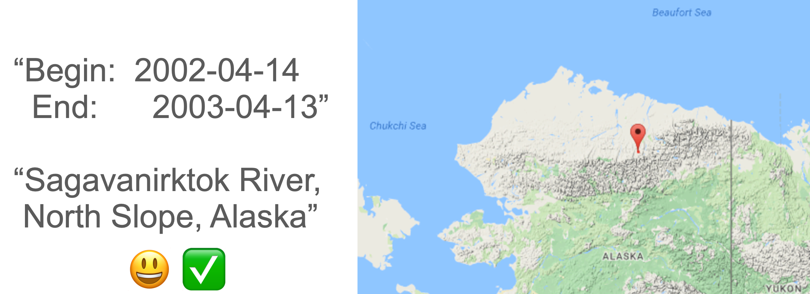
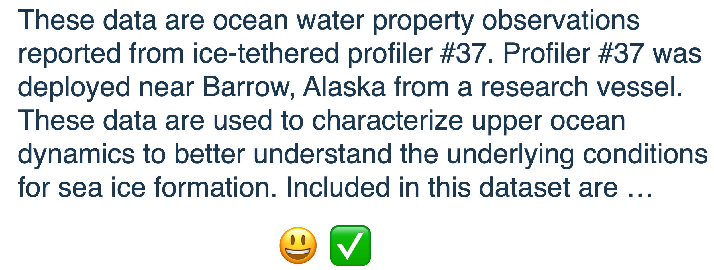

```{r setup, include=FALSE}
knitr::opts_chunk$set(echo = FALSE)
```

# What is Metadata?

**Think of metadata as data reporting -- Data about data**

- WHO created the data?

- WHAT is the content of the data?

- WHEN were the data collected?

- WHERE are the data from?

- HOW were the data developed?

- WHY were the data developed?

---

# What is Metadata important

### Metadata are important for the short and long-term utility of data


---

# Who uses metadata?

```{r, out.width="70%", fig.align='center'}

```

---

# Metadata for data Re-user

- Find relevant data

- Evaluate what is suitable for use in your work
- Retrieve the data you’ve found
- Understand if and how to actually use the data


---

# Metadata for data producers

- Avoid data duplication
   - What data have already been collected? 
   - Save time the next time
   - Hey, I’ve already done this!
   
- Share reliable information
   - What methods were used
   - How data were collected
   
- Publicize your work 
   - Citation
   - Credits 

---

# Metadata for organizations

- Help ensure the organization’s investment in the data
   - Ability to use data after initial intended purpose
   - Track data re-use and citation 

- Transcend people and time
   - Data are not lost when researchers or labs leave
   - Avoid duplication in new work 

- Advertise organization’s research
   - What data has our organization produced?
   
---

# Concerns about creating metadata

```{r, out.width="100%", fig.align='center'}
knitr::include_graphics("images/metadata_concerns.png")
```

---
class: center, middle, inverse

# Metadata standards

---

# Metadata Standards

### A metadata standard provides a uniform structure to describe data:

- Machine readable (e.g. XML)

- Common terminology

- Common structure

---

# Standard examples

- [Dublin Core](https://dublincore.org/) (emphasis on publications)

- [Darwin Core](https://dwc.tdwg.org/) (emphasis on collections)

- [FGDC](https://www.fgdc.gov/metadata) (emphasis on spatial data and gov. data)

- [ISO19115](https://www.iso.org/standard/53798.html) (emphasis on spatial data and services)

- [Ecological Metadata Language, EML](https://nceas.github.io/eml/) (emphasis on table attributes and taxonomy)

<br>

--

_More on the Research Data Alliance:_ https://rd-alliance.github.io/metadata-directory/standards/


---

# What makes a good metadata record?

### Overall goal: Could a reasonable scientist make sense of your data in 10, 20, 30+ years without contacting you?

<br>

When in doubt, be more specific:
- Spell out acronyms
- Use full names, emails, addresses, etc.

Include as much information as possible directly in the metadata record

---

# What makes a good metadata record?

Think about potential audiences / users:

- Someone looking directly for your data
- Someone who does not know about your work but should
- Someone looking to scrutinize your work
- Someone trying to reproduce your work
- Someone looking to give you credit for your work


---

# Titles

Good titles include: 

- What
- When
- Where

<br>
--

**The title is often the first way a user will evaluate your data set!!**

--

### Example:

"ITP37, 2009"

OR

"Ocean water property observations reported from ice-tethered profiler #37, Transpolar Drift, 2009"

---

# Metadata record

How do you describe the location and the period of observation of the data record is also very important!!

--

```{r, out.width="100%", fig.align='center'}

```


---

# Metadata record

```{r, out.width="100%", fig.align='center'}

```

---

# Metadata abstract

A good metadata abstract will:

- Be distinct from publication abstract

- Provide more context than the title

- Give a high-level summary of methodologies, data formats, coverage, etc.

--

```{r, out.width="100%", fig.align='center'}

```

---

# Metadata creators/authors

- Name alone is not enough...
   - to assign credit, nor
   - to disambiguate across data sets
   
- Email addresses help (when possible use one that can be passed on)
- Including an [ORCID iD](https://orcid.org/) is best


---

# Metadata attributes

- Column names

- Column name definitions (semantics!)

- Format strings for dates

- Units

- Missing value codes and definitions


