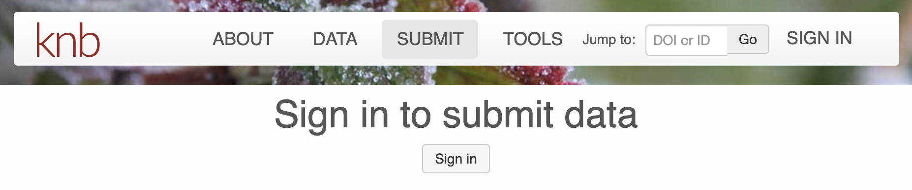
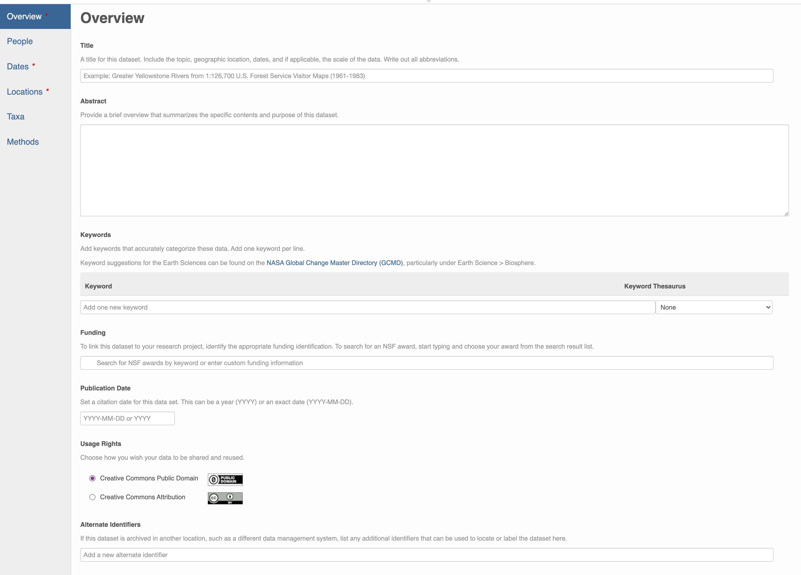
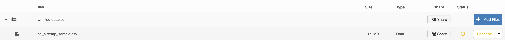

```{r setup, include=FALSE}
knitr::opts_chunk$set(echo = FALSE)
```


# Monday 10/18/2021 -- Lecture

## Data Semantics

**[Introduction](https://docs.google.com/presentation/d/e/2PACX-1vREUl0iUMXFsKUkCnBaU40wExFfy6T5EsSDR1MvFL9nFhKkJsZflyvZVxg43KOx4oDL-zuGLz4Z2Ztu/pub?start=false&loop=false&delayms=60000)**


**[Applied example of ontologies](https://docs.google.com/presentation/d/1_GWATrif3LmDhq9IWJ4EUNBNCKogE7tJwRNrsddf77E/edit?usp=sharing)**


### Exercise

Assemble your class project team and:

1. Discuss the definition of one concept you are using in your project (e.g forest)
2. Search the [Bioportal](https://bioportal.bioontology.org) repository (or the [ECSO ontology](https://bioportal.bioontology.org/ontologies/ECSO/?p=classes&conceptid=root) we discussed) and try to find the definition that matches the best your concept
3. Discuss any discrepancies you might have between your "team" definition and the one found online

If you found a matching definition save the purl referring to it!


# Wednesday 10/20/2021 -- Lab

## Archiving data

Let's us practice how to upload data to the KNB. Since we are not archiving a real data set, we will be using the developer site of the KNB: https://dev.nceas.ucsb.edu/data

To be able to upload a dataset, you will need to first create an ORCID: https://orcid.org/

As pair:

1. Download the data set: https://aurora.nceas.ucsb.edu/~brun/ntl_airtemp_sample.csv  
2. Click on the "Submit" button on the KNB 

```{r}

```

3. Fill up the form as much as you can about the general metadata 

```{r}

```

4. Add the csv file and click on describe to add the specific metadata 

```{r}

```

If you need inspiration, here is the original dataset the data sample was taken from: https://doi.org/10.6073/pasta/e3ff85971d817e9898bb8a83fb4c3a8b


## Working on your group project

